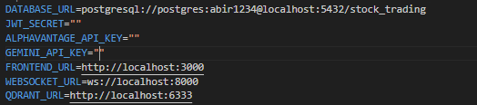
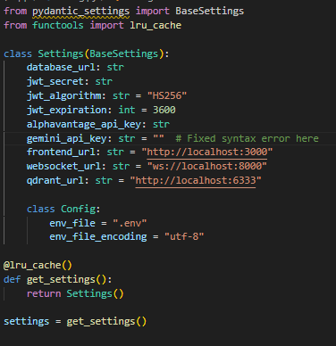

# 📈 Stock Trading Web Application API Documentation

**Version:** 0.1.0  
**OpenAPI Specification:** 3.1

---

## 🧭 Overview

This API provides functionality for user authentication, stock querying, PDF management, trade operations, and administrative features.

### 🔗 Base URL

All endpoints are relative to the base URL of the API.

---

## 🔐 Authentication

Most endpoints require authentication. After logging in, include the following header:

```
Authorization: Bearer {token}
```

---

## 📌 Endpoints

### 🧑 Authentication

#### ➕ Register

- **URL:** `/api/auth/register`
- **Method:** `POST`
- **Description:** Register a new user account
- **Request Body:**
```json
{
  "username": "string",
  "email": "string",
  "password": "string",
  "fullName": "string"
}
```
- **Response:**
```json
{
  "user_id": "string",
  "username": "string",
  "email": "string",
  "status": "pending",
  "message": "Registration successful. Approval pending."
}
```

#### 🔑 Login

- **URL:** `/api/auth/login`
- **Method:** `POST`
- **Description:** Authenticate and receive an access token
- **Request Body:**
```json
{
  "username": "string",
  "password": "string"
}
```
- **Response:**
```json
{
  "access_token": "string",
  "token_type": "Bearer",
  "user": {
    "user_id": "string",
    "username": "string",
    "role": "string"
  }
}
```

---

### 📉 Stock Queries

#### 🔍 Query Stock

- **URL:** `/api/stock/query`
- **Method:** `POST`
- **Description:** Query stock information
- **Request Body:**
```json
{
  "symbol": "string",
  "date_range": {
    "start": "YYYY-MM-DD",
    "end": "YYYY-MM-DD"
  },
  "parameters": ["price", "volume", "market_cap"]
}
```
- **Response:**
```json
{
  "symbol": "string",
  "name": "string",
  "data": [
    {
      "date": "string",
      "price": "number",
      "volume": "number",
      "market_cap": "number"
    }
  ],
  "summary": {
    "average_price": "number",
    "price_change": "number",
    "price_change_percent": "number"
  }
}
```

---

### 📄 PDF Operations

#### ⬆️ Upload PDF

- **URL:** `/api/pdf/upload`
- **Method:** `POST`
- **Description:** Upload a PDF document
- **Request Type:** `multipart/form-data`

#### 📑 Query PDF

- **URL:** `/api/pdf/query`
- **Method:** `POST`
- **Description:** Query information from an uploaded PDF
- **Request Body:**
```json
{
  "document_id": "string",
  "query": "string"
}
```
- **Response:**
```json
{
  "document_id": "string",
  "query": "string",
  "results": [
    {
      "page": "number",
      "text": "string",
      "relevance": "number"
    }
  ]
}
```

---

## 📚 WebSocket Endpoints

| Endpoint | Description |
|----------|-------------|
| `/ws/debug/token` | Token debugging |
| `/ws/chat/partners` | Retrieve chat partners |
| `/ws/chat/history/{user_id}` | Get chat history |
| `/ws/chat/send` | Send a message |
| `/ws/chat/read/{sender_id}` | Mark messages as read |
| `/ws/chat/unread/count` | Get unread count |
| `/ws/chat/unread` | Get all unread messages |

---

## 🏠 Root Endpoint

- **URL:** `/`
- **Method:** `GET`
- **Response:**
```json
{
  "name": "Stock Trading Web Application API",
  "version": "0.1.0",
  "status": "active"
}
```

---

## 🧬 Schema Definitions

### User
```json
{
  "user_id": "string",
  "username": "string",
  "email": "string",
  "fullName": "string",
  "role": "client|admin",
  "status": "active|pending|suspended",
  "created_at": "datetime"
}
```

### Trade
```json
{
  "trade_id": "string",
  "user_id": "string",
  "symbol": "string",
  "quantity": "number",
  "price": "number",
  "action": "buy|sell",
  "status": "pending|approved|rejected|completed",
  "created_at": "datetime",
  "updated_at": "datetime"
}
```

---

## ⚠️ Error Responses

All errors follow this format:
```json
{
  "error": true,
  "code": "string",
  "message": "string",
  "details": "object (optional)"
}
```

### Common Error Codes

| Code | Description |
|------|-------------|
| 400  | Bad Request |
| 401  | Unauthorized |
| 403  | Forbidden |
| 404  | Not Found |
| 409  | Conflict |
| 422  | Unprocessable Entity |
| 500  | Internal Server Error |

---

> For further updates and contributions, feel free to fork this repo and submit a pull request.
# Installation Guide

## Setup Process

### Backend Setup

1.  Navigate to the backend folder:

-   cd backend

2.  Install required dependencies:

-   pip install -r requirements.txt

3.  Configure environment variables:

    -   Create a `.env` file in the backend directory
        -   Here setup alphavantage api
        -   Example:

> {width="5.459095581802274in"
> height="1.2085017497812773in"}

-   Create a config.py in backend/app directory
    -   Here setup gemini api
    -   Example

> {width="3.9172134733158357in"
> height="4.042230971128609in"}

-   Add your database connection details

### Qdrant Database Setup

1.  Run Qdrant database using Docker:

-   docker run -p 6333:6333 -p 6334:6334 qdrant/qdrant

2.  Update your `.env` file with the Qdrant port configuration

### Launch the Application

1.  Start the backend server:

-   - cd backend

        - python –m venv venv

        - .\vevn\Scripts\activate

        -   uvicorn app.main:app --reload --host 0.0.0.0 --port 8000

    The backend will run on `localhost:8000`

2.  Start the frontend:

-   Simply run the frontend through vscode live server

    The frontend will be available at `localhost:5500`

## Verification

-   Backend API: http://localhost:8000
-   Frontend interface: http://localhost:5500
